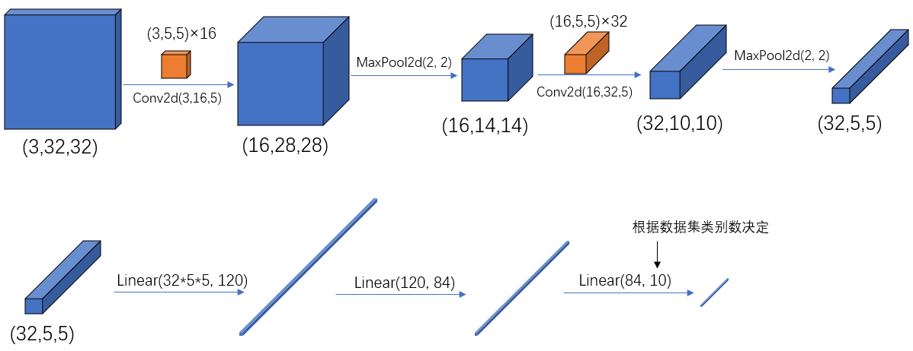
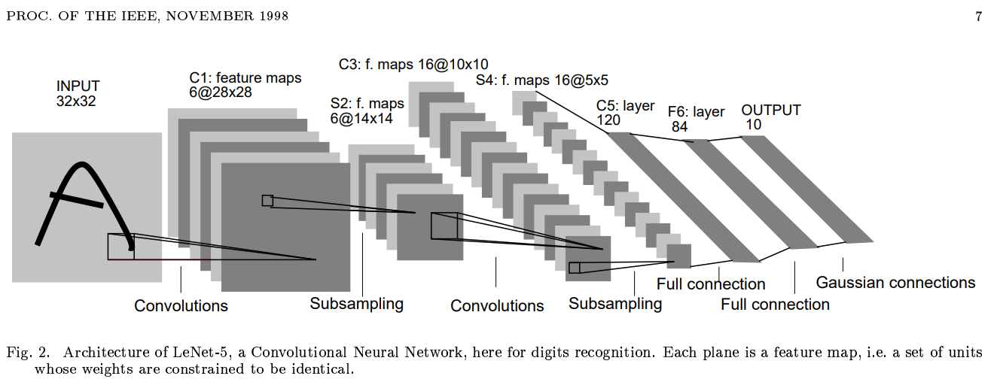

# LeNet-5模型详解

## 网络结构图

- pytorch 中 tensor（也就是输入输出层）的 通道排序为：[batch, channel, height, width]

- $$
  \mathrm{Output}={\frac{\left(\mathbf{W}-\mathbf{F}+2\mathbf{P}\right)}{\mathbf{S}}}+1
  $$

- 

- **输入通道个数 等于 卷积核通道个数**

- **卷积核个数 等于 输出通道个数**

## 名词解释

|     **名词**      | 定义                                                         |
| :---------------: | ------------------------------------------------------------ |
|       epoch       | 对训练集的全部数据进行一次完整的训练，称为 一次 epoch        |
|       batch       | 由于硬件算力有限，实际训练时将训练集分成多个批次训练，每批数据的大小为 batch_size |
| iteration 或 step | 对一个batch的数据训练的过程称为 一个 iteration 或 step       |

> 若训练集一共有50000个样本，设batch_size=50，那么完整的训练一次样本：iteration或step=1000，epoch=1

# 参考

https://pytorch.org/tutorials/beginner/blitz/cifar10_tutorial.html#

https://blog.csdn.net/muye_IT/article/details/123539199

