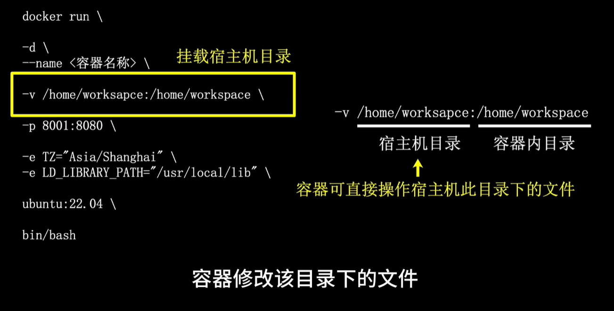

```
# 查看镜像
docker images

# 删除镜像和容器
# https://blog.csdn.net/u014282578/article/details/127866389
## 通过标签删除镜像
docker rmi [image] 或者 docker image rm [image]

## 通过 ID 删除镜像
docker rmi ee7cbd482336

# 查看 docker 的占用空间
# https://zhuanlan.zhihu.com/p/100793598
docker system df

# docker run 和 docker start 的区别
https://blog.csdn.net/weixin_44722978/article/details/89704085
docker run 只在第一次运行时使用， 相当于执行了两步操作：将镜像放入容器中（docker create）,然后将容器启动，使之变成运行时容器（docker start）。
docker start的作用是，重新启动已存在的镜像。

https://www.cnblogs.com/maplebee/p/13635176.html
https://fishc.com.cn/thread-238303-1-1.html

```

## docker 里的容器增加端口暴露的参数

```
# https://blog.csdn.net/hualinger/article/details/135386889


# 查看该容器暴露的端口
docker port <container_id_or_name>
## 也可以通过docker ps命令的 PORTS 列来查看


```


# docker 换源

[docker pull使用国内镜像加速也十分慢的解决办法 - Right2014 - 博客园 (cnblogs.com)](https://www.cnblogs.com/ALice1024/p/17242552.html)

https://hdke96g2.mirror.aliyuncs.com

[容器镜像服务 (aliyun.com)](https://cr.console.aliyun.com/cn-hangzhou/instances/mirrors?accounttraceid=0d67d04e3a824605b9576bb9d6e1c1abzufv)


# docker 的工作原理

## 1-1 docker 四部分

远程镜像仓库、本地镜像、本地容器、docker软件


远程镜像仓库：是云端的镜像仓库， 供用户上传、下载需要的镜像， 默认是dockerhub，也可以换成其他的仓库

本地镜像：是下载好的镜像或自己打包好的镜像，镜像可以理解以为容器的模版，等同于安装电脑操作系统的光盘


本地容器：真正运行的实例，可以理解为独立的Linux系统，容器是根据镜像创建的，容器被创建

# docker镜像

 # docker 容器


# 容器的创建方式


# 容器的创建命令详解




