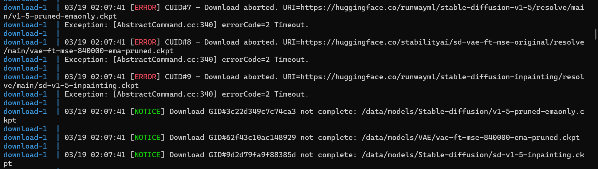
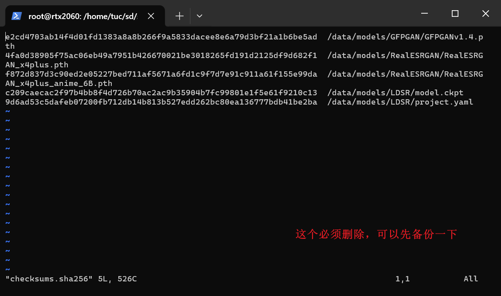

# sd安装教程


https://docs.stablediffusion.cn/?m=Article&a=index&id=1&aid=593327411932692480


```
# 1、克隆stable-diffusion-webui-docker仓库
git clone https://github.com/AbdBarho/stable-diffusion-webui-docker.git

# 2、进入stable-diffusion-webui-docker目录，运行命令
docker compose --profile download up --build

没有报错后运行下面的命令

docker compose --profile auto up --build

# 没报错就可以在 浏览器里访问 127.0.0.1:7860 或者 在局域网内访问 `localhost_ip:7860`


```

# 问题汇总

在执行 `docker compose --profile download up --build` 命令时遇到下面



解决方法：

需要在网页上将这三个文件下载下来，存放在对应的位置，然后将 `stable-diffusion-webui-docker/services/download` 下的 links.txt 和 checksums.txt 中对应的模型文件文件地址删掉，如下




遇到下面的问题


解决方法：

修改 `stable-diffusion-webui-docker/services/AUTOMATIC1111` git 版本号，改为 2.43.0，原本是2.36.0

注意事项：修改之后要重新执行 `docker compose --profile download up --build` 命令后再执行 `docker compose --profile auto up --build` 命令。

 

保错 `OS Error`


解决方法：

```
docker ps -a

# 找到最新名为 webui-aoto-1 的container，

docker start webui-aoto-1

# 进入这个 container

docker exec -it /bash

# 复制主机下载好的openai文件夹到container内，注意不要修改openai文件夹的名字
下载地址： git clone https://huggingface.co/openai/clip-vit-large-patch14/tree/main
注意四个大的模型文件需要使用网页下载

docker cp openai/ 38eaa6108fca:/stable-diffusion-webui

# 复制进去后关闭container
docker stop webui-aoto-1

# 在执行 docker compose --profile auto up --build 命令
```


# 模型配置教程

```
模型地址：
https://civitai.com/models/235746/tamarinxl?modelVersionId=265836

https://civitai.com/images/4827235


```


