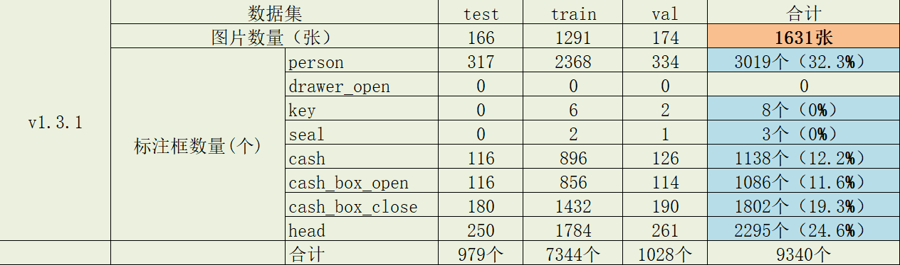
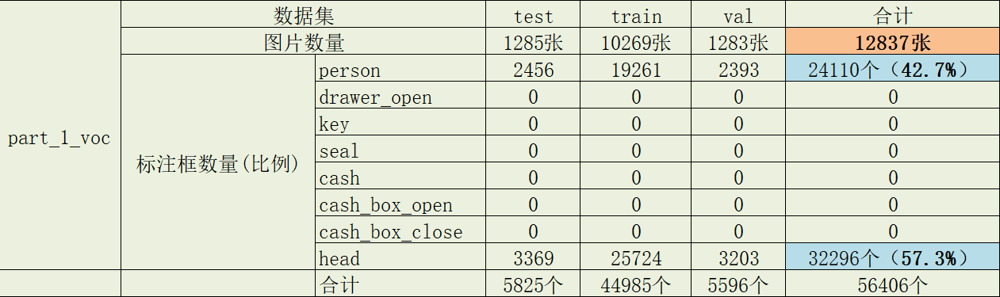
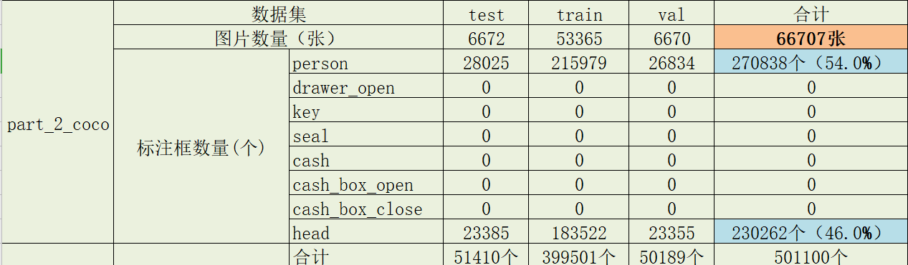
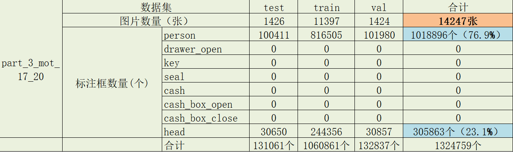
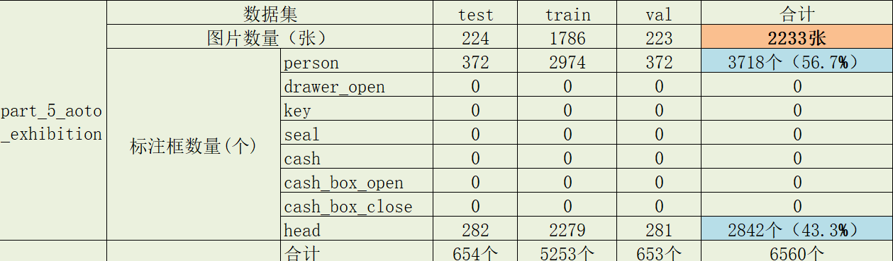
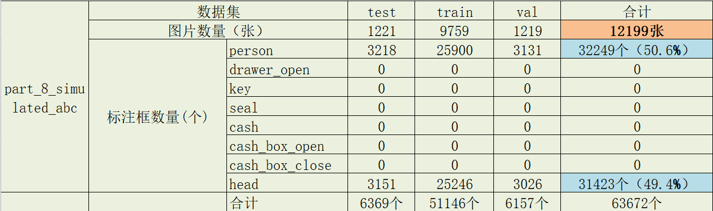
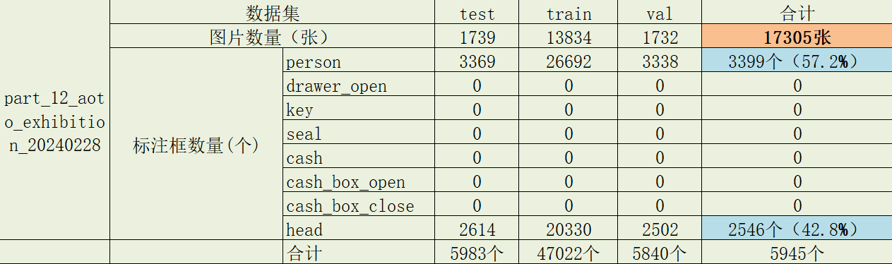

# 合计

## 图片数量

<table align="center">
    <tr align="center">
        <th>数据集</th>
        <th>图片数量</th>
        <th>比列</th>
        <th>合计</th>
    </tr>
    <tr align="center">
        <td>测试集</td>
        <td>5961+255+13030=19246张</td>
        <td>9.6%</td>
        <td rowspan="3" align="center" valign="middle">201295张</td>
    </tr>
    <tr align="center">
        <td>训练集</td>
        <td>55700+2119+104073=161892张</td>
        <td>80.4%</td>
    </tr>
    <tr align="center">
        <td>验证集</td>
        <td>6879+257+13021=20157张</td>
        <td>10.0%</td>
    </tr>
</table>

## 标注框数量

|      类别      |         标注框数量         | 占比  |  总计   |
| :------------: | :------------------------: | :---: | :-----: |
|     person     | 1363522+367+109537=1473426 | 68.6% | 2147875 |
|  drawer_open   |            979             |   0   |         |
|      key       |      8+1547+1290=2845      | 0.1%  |         |
|      seal      |      3+1017+655=1675       |   0   |         |
|      cash      |     1138+742+1859=3739     | 0.2%  |         |
| cash_box_open  |            1086            |   0   |         |
| cash_box_close |            1802            |   0   |         |
|      head      |  612663+280+49380=662323   | 30.8% |         |

# bcvd _V1.3.1

## 图片数量

<table align="center">
    <tr align="center">
        <th>数据集</th>
        <th>图片数量</th>
        <th>比列</th>
        <th>合计</th>
    </tr>
    <tr align="center">
        <td>测试集</td>
        <td>1285+6672+1426+224+1221+297+1739+166=13030张</td>
        <td>10.0%</td>
        <td rowspan="3" align="center" valign="middle">130124张</td>
    </tr>
    <tr align="center">
        <td>训练集</td>
        <td>10269+53365+11397+1786+9759+2372+13834+1291=104073张</td>
        <td>80.0%</td>
    </tr>
    <tr align="center">
        <td>验证集</td>
        <td>1283+6670+1424+223+1219+296+1732+174=13021张</td>
        <td>10.0%</td>
    </tr>
</table>

## 标注框数量

|      类别      |                       标注框数量                       | 占比  |  总计   |
| :------------: | :----------------------------------------------------: | :---: | :-----: |
|     person     | 24110+270838+1018896+3718+32249+7293+3399+3019=1363522 | 68.9% | 1980222 |
|  drawer_open   |                           0                            |   0   |         |
|      key       |                           8                            |   0   |         |
|      seal      |                           3                            |   0   |         |
|      cash      |                          1138                          | 0.1%  |         |
| cash_box_open  |                          1086                          | 0.1%  |         |
| cash_box_close |                          1802                          | 0.1%  |         |
|      head      |  32296+230262+305863+2842+31423+5136+2546+2295=612663  | 30.9% |         |

## 详细数据

### v1.3.1

### person_detection_v2.2

# bcvd _V1.1

## 图片数量

<table align="center">
    <tr align="center">
        <th>数据集</th>
        <th>图片数量</th>
        <th>比列</th>
        <th>合计</th>
    </tr>
    <tr align="center">
        <td>测试集</td>
        <td>255张</td>
        <td>9.7%</td>
        <td rowspan="3" align="center" valign="middle">2631张</td>
    </tr>
    <tr align="center">
        <td>训练集</td>
        <td>2119张</td>
        <td>80.5%</td>
    </tr>
    <tr align="center">
        <td>验证集</td>
        <td>257张</td>
        <td>9.8%</td>
    </tr>
</table>

## 标注框数量

|      类别      | 标注框数量 | 占比  | 总计 |
| :------------: | :--------: | :---: | :--: |
|     person     |    367     | 9.3%  | 3953 |
|  drawer_open   |     0      |   0   |      |
|      key       |    1547    | 39.1% |      |
|      seal      |    1017    | 25.7% |      |
|      cash      |    742     | 18.8% |      |
| cash_box_open  |     0      |   0   |      |
| cash_box_close |     0      |   0   |      |
|      head      |    280     | 7.1%  |      |

# bcvd _V1.0

## 图片数量

<table align="center">
    <tr align="center">
        <th>数据集</th>
        <th>图片数量</th>
        <th>比列</th>
        <th>合计</th>
    </tr>
    <tr align="center">
        <td>测试集</td>
        <td>5961张</td>
        <td>8.7%</td>
        <td rowspan="3" align="center" valign="middle">68540张</td>
    </tr>
    <tr align="center">
        <td>训练集</td>
        <td>55700张</td>
        <td>81.3%</td>
    </tr>
    <tr align="center">
        <td>验证集</td>
        <td>6879张</td>
        <td>10.0%</td>
    </tr>
</table>

## 标注框数量

|      类别      | 标注框数量 | 占比  |  总计   |
| :------------: | :--------: | :---: | :-----: |
|     person     |   109537   | 66.9% | 163,700 |
|  drawer_open   |    979     | 0.6%  |         |
|      key       |    1290    | 0.7%  |         |
|      seal      |    655     | 0.4%  |         |
|      cash      |    1859    | 1.1%  |         |
| cash_box_open  |     0      |   0   |         |
| cash_box_close |     0      |   0   |         |
|      head      |   49380    | 30.2% |         |

